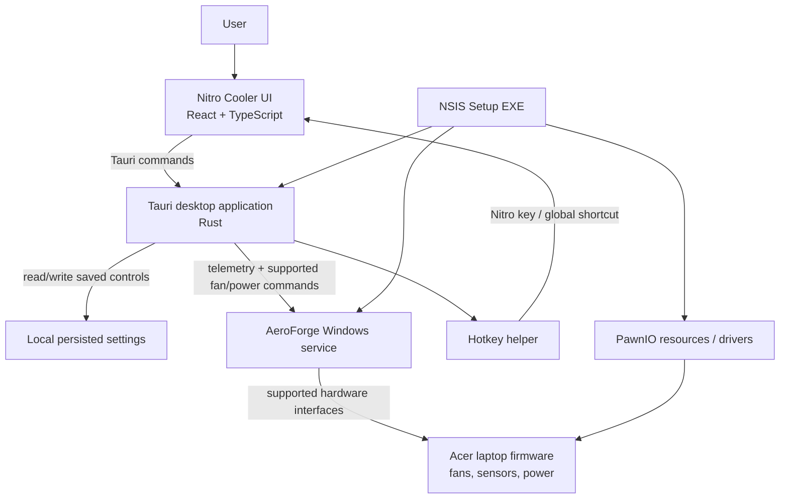

# Nitro Cooler

Nitro Cooler is a Windows desktop companion for supported Acer Nitro laptops. It provides a NitroSense-inspired interface for monitoring temperatures and fan speed, choosing supported fan and power profiles, and saving your preferred controls between launches.

> [!WARNING]
> Nitro Cooler is not made, endorsed, or supported by Acer. Fan and power controls can affect temperature, noise, power use, and system stability. Use it only on supported hardware and at your own risk.

## Download and install

For a normal installation, use the **Setup EXE** from the GitHub Release assets:

`Nitro Cooler_0.16.3_x64-setup.exe`

1. Download the Setup EXE.
2. Right-click it and choose **Run as administrator**.
3. Accept the Windows security/UAC prompt.
4. Complete the installer. It installs Nitro Cooler, the required AeroForge hardware service, its helper, the WebView runtime loader, and the required PawnIO resources.
5. Open **Nitro Cooler** from the Start menu or its desktop shortcut.

The portable ZIP is optional. Extract `NitroCooler_0.16.3_x64-portable.zip` and run `aeroforge-control.exe`. It is useful for carrying the UI, but a new computer still needs the Setup EXE first for real hardware fan and power control because the Windows service must be installed with administrator permission.

## What it can do

### Fan control and monitoring

- Live CPU and GPU temperature, utilisation, and RPM monitoring.
- Animated CPU/GPU fan dials.
- **Auto** fan mode.
- **Max** fan mode.
- **Custom** mode with separate CPU and GPU fan sliders.
- Separate **Auto** switches in Custom mode. While Auto is enabled, that slider is intentionally disabled and the temperature curve controls the fan.
- **CoolBoost** is enabled by default and uses temperature-based automatic fan control rather than locking the fans at maximum speed.
- Temperature/load history graphs.

### Power profiles

- Power Saver
- Balance
- Balance (Acer Optimized)
- High-Performance
- AC/Battery display selector

### Window and interface controls

- Minimize and Close buttons.
- Fan, power, CoolBoost, Custom settings, and supported preferences are restored after closing and reopening the app.
- Celsius/Fahrenheit display setting.
- A keyboard-lighting window with brightness, four visual zones, zone colour choices, and zone on/off controls.
- Advanced settings for Sticky Keys, Windows/Menu key behaviour, and keyboard-backlight timeout preferences.

## Hardware-support notes

The following controls are connected to the installed background service when it reports support on the laptop:

- Fan profiles: Auto, Max, and Custom curves
- CPU/GPU custom fan settings
- CoolBoost automatic fan behaviour
- Power profiles
- Live hardware telemetry

The keyboard-lighting controls and the Sticky Keys, Windows/Menu key, and backlight-timeout switches are currently **saved preferences**. The bundled service does not yet expose verified Acer firmware commands for these features, so they are restored by Nitro Cooler but should not be treated as physical keyboard/firmware control. Dynamic keyboard lighting is deliberately marked as coming later.

The AC/Battery selector changes the interface view. Select a power-profile button to apply a power profile.

## Architecture



The window you see is React/TypeScript. It sends commands to the Rust Tauri layer. The Rust layer talks to the installed Windows service, which is the component allowed to work with supported hardware interfaces. The UI alone cannot control the fans.

## Release files for GitHub

Create a **GitHub Release** for each version and attach these files from the local `portable` folder:

| File | Upload? | Purpose |
| --- | --- | --- |
| `NitroCooler_0.16.3_x64-setup.exe` | Yes — required | Normal installer; includes the service resources needed for hardware control. |
| `NitroCooler_0.16.3_x64-portable.zip` | Optional | Portable UI package. It still needs the Setup EXE to have been installed first on a new computer. |
| `AeroForge-Debug-Collector-0.16.3.zip` | Optional | Support tool for collecting diagnostics when someone reports a problem. |

You do **not** upload the whole `portable` folder, `node_modules`, `dist`, or `src-tauri/target` to GitHub Releases. Upload the individual release files listed above.

For the GitHub **repository** itself, push the source code, including `src`, `src-tauri`, `aeroforge-service`, `assets`, `scripts`, `package.json`, `package-lock.json`, `Cargo.toml`, and `Cargo.lock`. Do not commit generated build folders or release files unless you intentionally want to store binaries in the repository.

## Build from source

Prerequisites:

- Windows 10/11 x64
- Node.js and npm
- Rust (GNU Windows target used by this project)
- LLVM-MinGW on `PATH`
- NSIS (normally supplied through the Tauri bundling toolchain)

Build the installer and portable package:

```powershell
npm run tauri:build
powershell -ExecutionPolicy Bypass -File scripts/Make-Portable.ps1
```

The installer will be written to `src-tauri/target/release/bundle/nsis`. The portable ZIP will be written to `portable`.

## Credits and licence

Nitro Cooler is a fork of [AeroForge NitroSense Alternative](https://github.com/noahcabral/aeroforge-nitrosense-alternative). Credit belongs to the original author and contributors. See the upstream project for applicable licence and attribution requirements.
