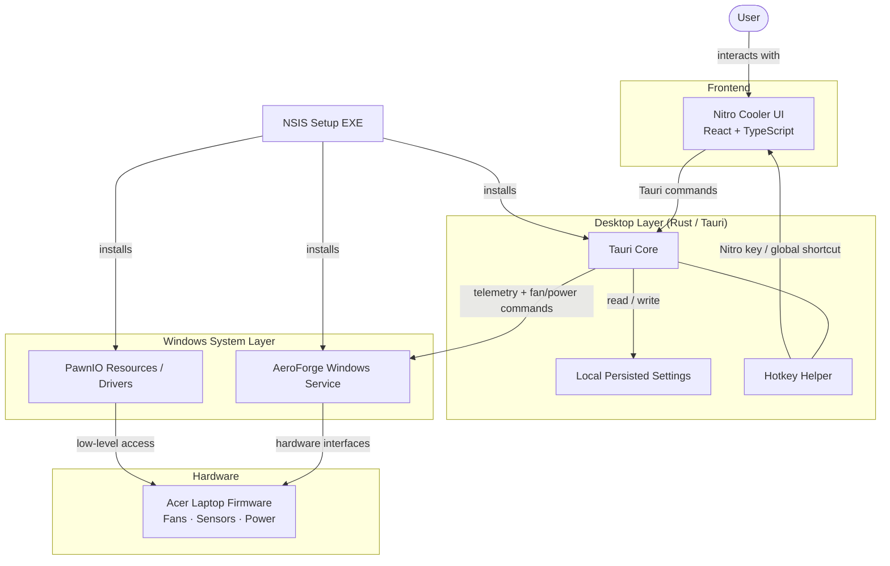

# Nitro Cooler

> **⚠️ This is not a replacement for NitroSense.**
> Acer's official [NitroSense](https://www.acer.com/us-en/gaming/nitro) software is the recommended way to manage your Acer Nitro laptop. Nitro Cooler exists for a very specific reason: on my machine, NitroSense simply **would not open** — no error, no window, nothing. After exhausting every fix (reinstalling, repairing the Microsoft Store, running compatibility troubleshooters, updating every driver), it still refused to launch. Rather than give up and lose fan and power control entirely, I built my own tool. **If NitroSense works for you, use that.** Nitro Cooler is for people who, for whatever reason, can't get the official app running.

Nitro Cooler is a Windows desktop companion for supported Acer Nitro laptops. It provides a NitroSense-inspired interface for monitoring temperatures and fan speed, choosing supported fan and power profiles, and saving your preferred controls between launches.

> [!WARNING]
> Nitro Cooler is not made, endorsed, or supported by Acer. Fan and power controls can affect temperature, noise, power use, and system stability. Use it only on supported hardware and at your own risk.

---

## Preview

https://github.com/oscarrego/Nitro-Cooler/assets/preview.mov

> Can't see the video? Find it at [`assets/preview.mov`](assets/preview.mov).

---

## Download and Install

For a normal installation, use the **Setup EXE** from the GitHub Release assets:

```
Nitro Cooler_0.16.3_x64-setup.exe
```

1. Download the Setup EXE.
2. Right-click it and choose **Run as administrator**.
3. Accept the Windows security / UAC prompt.
4. Complete the installer — it installs Nitro Cooler, the required AeroForge hardware service, its helper, the WebView runtime loader, and the required PawnIO resources.
5. Open **Nitro Cooler** from the Start menu or its desktop shortcut.

> [!NOTE]
> The **portable ZIP** (`NitroCooler_0.16.3_x64-portable.zip`) is optional. Extract it and run `aeroforge-control.exe`. Useful for carrying the UI, but a new computer still needs the Setup EXE first — the Windows service must be installed with administrator permission before hardware control works.

---

## Features

### Fan Control and Monitoring

| Feature | Details |
|---|---|
| Live telemetry | CPU & GPU temperature, utilisation, and RPM |
| Animated dials | CPU / GPU fan speed visualisation |
| Auto mode | Temperature-curve-based automatic fan control |
| Max mode | Pushes fans to maximum speed |
| Custom mode | Separate CPU and GPU fan sliders |
| CoolBoost | Temperature-based auto control (not locked-max) |
| History graphs | Temperature and load over time |

### Power Profiles

- Power Saver
- Balanced
- Balanced (Acer Optimised)
- High-Performance
- AC / Battery display selector

### Interface Controls

- Minimize and Close buttons
- All fan, power, CoolBoost, and Custom settings restored on relaunch
- Celsius / Fahrenheit toggle
- Keyboard-lighting window — brightness, four visual zones, zone colours, zone on/off
- Advanced settings — Sticky Keys, Windows / Menu key behaviour, backlight timeout

---

## Hardware-Support Notes

The following controls are connected to the installed background service when it reports support on the laptop:

- Fan profiles: Auto, Max, and Custom curves
- CPU / GPU custom fan settings
- CoolBoost automatic fan behaviour
- Power profiles
- Live hardware telemetry

> [!NOTE]
> The keyboard-lighting controls and the Sticky Keys, Windows/Menu key, and backlight-timeout switches are currently **saved preferences only**. The bundled service does not yet expose verified Acer firmware commands for these features, so they are restored by Nitro Cooler but should not be treated as physical keyboard/firmware control. Dynamic keyboard lighting is deliberately marked as coming later.

The AC/Battery selector changes the interface view. Select a power-profile button to apply a power profile.

---

## Architecture



The window you see is React + TypeScript. It sends commands through the Rust Tauri layer. The Rust layer talks to the installed Windows service, which is the **only** component permitted to communicate with supported hardware interfaces. The UI alone cannot control the fans.

---

## Release Files

Create a **GitHub Release** for each version and attach these files from the local `portable` folder:

| File | Required | Purpose |
|---|---|---|
| `NitroCooler_0.16.3_x64-setup.exe` | ✅ Yes | Full installer — includes the service and hardware resources |
| `NitroCooler_0.16.3_x64-portable.zip` | Optional | Portable UI — still needs the Setup EXE on a new machine |
| `AeroForge-Debug-Collector-0.16.3.zip` | Optional | Diagnostics collector for bug reports |

> [!CAUTION]
> Do **not** upload the whole `portable` folder, `node_modules`, `dist`, or `src-tauri/target` to GitHub Releases. Upload only the individual files listed above.

For the GitHub **repository**, push the source code: `src`, `src-tauri`, `aeroforge-service`, `assets`, `scripts`, `package.json`, `package-lock.json`, `Cargo.toml`, and `Cargo.lock`. Do not commit generated build folders or release binaries.

---

## Build from Source

**Prerequisites:**

- Windows 10 / 11 x64
- Node.js and npm
- Rust (GNU Windows target)
- LLVM-MinGW on `PATH`
- NSIS (normally supplied through the Tauri bundling toolchain)

**Build:**

```powershell
npm run tauri:build
powershell -ExecutionPolicy Bypass -File scripts/Make-Portable.ps1
```

The installer will be written to `src-tauri/target/release/bundle/nsis`.
The portable ZIP will be written to `portable/`.

---

## Credits and Licence

Nitro Cooler is a fork of [AeroForge NitroSense Alternative](https://github.com/noahcabral/aeroforge-nitrosense-alternative). Credit belongs to the original author and contributors. See the upstream project for the applicable licence and attribution requirements.
