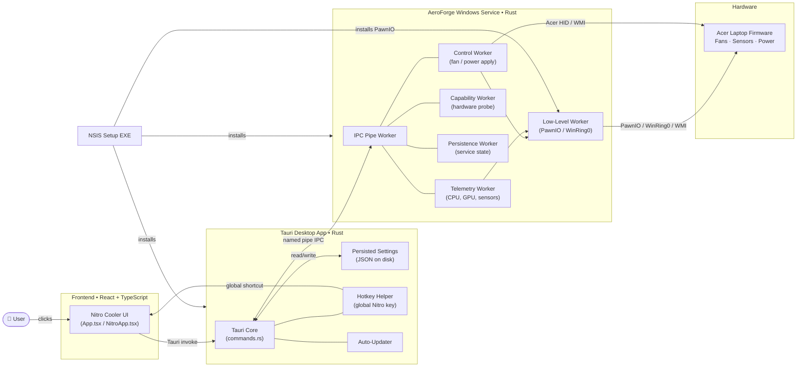

# Nitro Cooler

> [!NOTE]
> **Not a replacement for NitroSense.** Use Acer's official app if it works for you. I built Nitro Cooler because NitroSense silently refused to open on my machine — no error, no window — and after every fix I could find failed, I needed fan and power control somehow.

Nitro Cooler is a Windows desktop companion for supported Acer Nitro laptops — fan monitoring, fan profiles, power profiles, and persistent settings between launches.

> [!WARNING]
> Not made, endorsed, or supported by Acer. Fan and power controls affect temperature, noise, and stability. Use on supported hardware at your own risk.

---

## Preview


---

## Download — NitroCooler v1.0

Get the **[latest release →](../../releases/latest)**

| File | Purpose |
|---|---|
| `NitroCooler-v1.0-setup.exe` | ✅ Full installer — installs the app, AeroForge service, PawnIO drivers |
| `NitroCooler-v1.0-portable.zip` | Portable UI only — still needs the Setup EXE run once on a new machine |

**Steps:**
1. Download `NitroCooler-v1.0-setup.exe`
2. Right-click → **Run as administrator**
3. Accept the UAC prompt and complete the installer
4. Open **Nitro Cooler** from the Start menu or desktop shortcut

---

## Features

### Fan Control and Monitoring

| Feature | Details |
|---|---|
| Live telemetry | CPU & GPU temperature, utilisation, clock speed, and RPM |
| Fan dials | Animated CPU / GPU fan speed gauges |
| Auto mode | Temperature-curve-based automatic fan control |
| Max mode | Locks fans to maximum speed |
| Custom mode | Independent CPU and GPU fan sliders with per-fan Auto toggle |
| CoolBoost | Smart temp-based control — not just locked-max |
| Fan calibration | Sweep-based RPM calibration tool |
| History graphs | Temperature and load over time |

### Power Profiles

- Power Saver · Balanced · Balanced (Acer Optimised) · High-Performance
- GPU tuning — core clock, memory clock, voltage offset, power limit, temp limit
- OC presets with named slots
- Smart charging (battery health mode)
- AC / Battery view selector

### Interface and Extras

- All settings (fan, power, CoolBoost, custom curves) restored on relaunch
- Celsius / Fahrenheit toggle
- Blue light filter
- Auto display refresh rate on battery
- Boot logo customisation (Ember, Arc, Slate, custom image)
- Keyboard-lighting — brightness, 4 zones, zone colours, zone on/off *(saved preferences — firmware write coming later)*
- Advanced — Sticky Keys, Windows/Menu key lock, backlight timeout
- Global Nitro key shortcut (via hotkey helper)
- Auto-updater (stable / preview channel)
- Single-instance enforcement

---

## Architecture



**Data flow in plain English:**

1. You interact with the **React UI** running inside a Tauri WebView window.
2. The UI calls **Tauri commands** (Rust) via `invoke()`.
3. The Rust core talks to the **AeroForge Windows service** through a local named pipe.
4. The service's **Control** and **Telemetry** workers read and write Acer hardware through **PawnIO / WinRing0 drivers** and Windows WMI/HID interfaces.
5. The **Hotkey Helper** binary runs separately and fires the global Nitro key shortcut back to the UI.
6. Settings are persisted to a local JSON config file by the Rust core.

The UI **cannot** control hardware directly — it always goes through the service.

---

## Build from Source

**Prerequisites:** Windows 10/11 x64 · Node.js + npm · Rust (GNU target) · LLVM-MinGW on `PATH` · NSIS

```powershell
npm run tauri:build
powershell -ExecutionPolicy Bypass -File scripts/Make-Portable.ps1
```

Installer → `src-tauri/target/release/bundle/nsis/`  
Portable ZIP → `portable/`

---

## Credits and Licence

Nitro Cooler is a fork of [AeroForge NitroSense Alternative](https://github.com/noahcabral/aeroforge-nitrosense-alternative). Credit belongs to the original author and contributors. See the upstream project for the applicable licence and attribution requirements.

